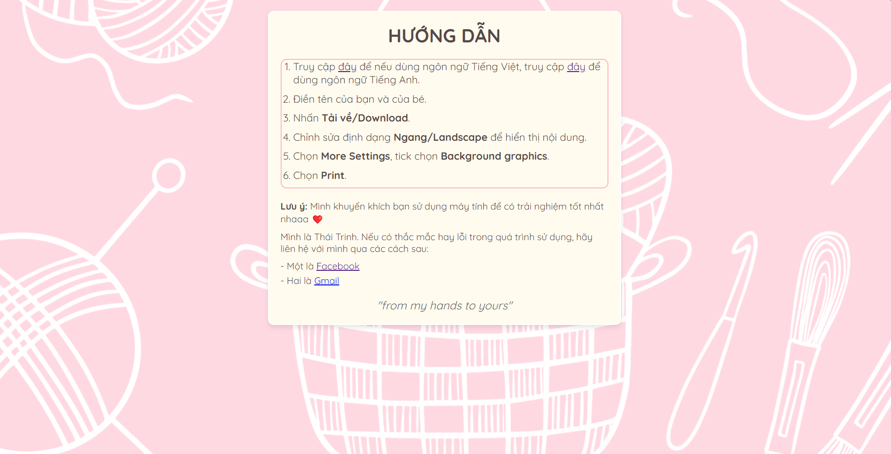
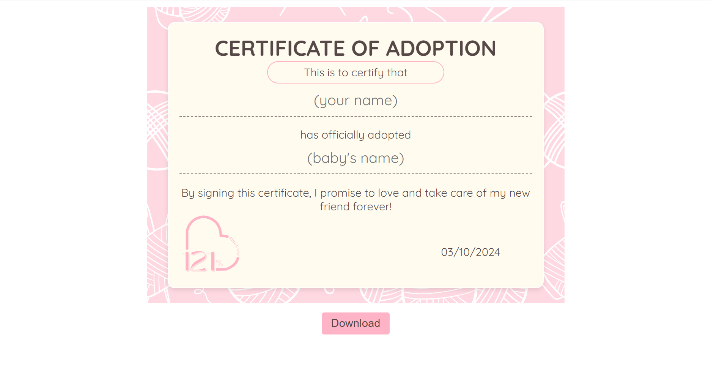

# @fluei.xia's Certificate of Adoption

  

This website allows users (mostly my friends) to create and download a personalized *Certificate of Adoption*. It consists of 3 web pages: one for instructions and contact information, and the others for entering personal details to generate a downloadable PDF certificate.

You can visit my website [here](https://solivaquaant.github.io/fluei.xia-certificate/)💕
## Table of Contents
- [@fluei.xia's Certificate of Adoption](#flueixias-certificate-of-adoption)
  - [Table of Contents](#table-of-contents)
  - [What is @fluei.xia?](#what-is-flueixia)
  - [Project Overview](#project-overview)
  - [Features](#features)
  - [Technologies Used](#technologies-used)
  - [Usage](#usage)
  - [Contributing](#contributing)

## What is @fluei.xia?
>If you're wondering, *@fluei.xia* is the name I use to represent myself when I give handmade gifts to friends. The logo consists of a pink heart and the number *121%*, symbolizing my birthday on October 12th. More than just a date, the 121% reflects my wish for the recipients of my gifts to experience happiness that goes beyond 100%—a full 121% 💗

## Project Overview
The project consists of 3 web pages:
1. **Instructions Page**: This page provides an overview of how to use the app and includes contact information for assistance.

2. **Certificate Pages**: These pages allow users to input their name and the baby's name. Once the form is completed, users can download a PDF Certificate of Adoption. One certificate is written in Vietnamese, and the other is in English.

## Features
- Simple and intuitive interface.
- Ability to download a personalized Certificate of Adoption in PDF format.
- Responsive design for multiple screen sizes.

## Technologies Used
- **HTML5**: Structure of the web pages.
- **CSS3**: Styling and layout for responsive design.
- **JavaScript**: Logic for form validation and generating the PDF.

## Usage
1. On the **Instructions Page**, read the guidelines on how to use.
2. Navigate to the user input pages to enter your name and the baby’s name.
3. Once the names are entered, click the **Download** button to generate and download the personalized Certificate of Adoption in PDF format. Super simple💥

## Contributing
Contributions are welcome! To contribute:
1. Fork this repository.
2. Create a new branch with your feature or fix.
3. Submit a pull request, and I'll review your changes. Many thankss :>
